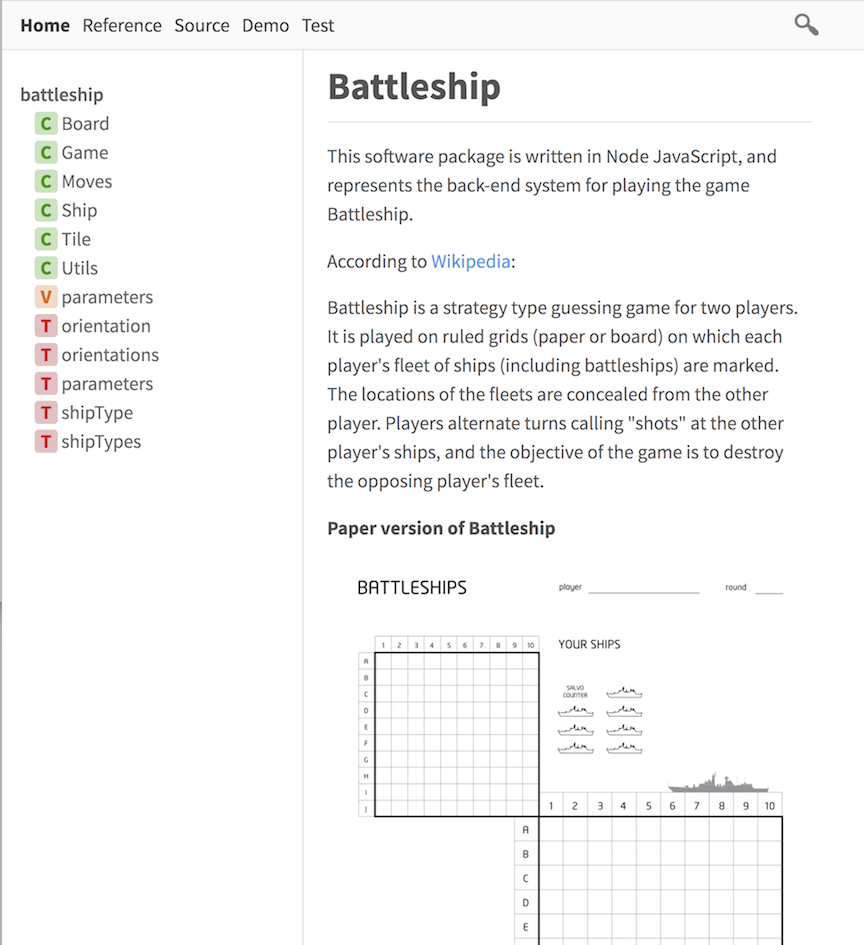
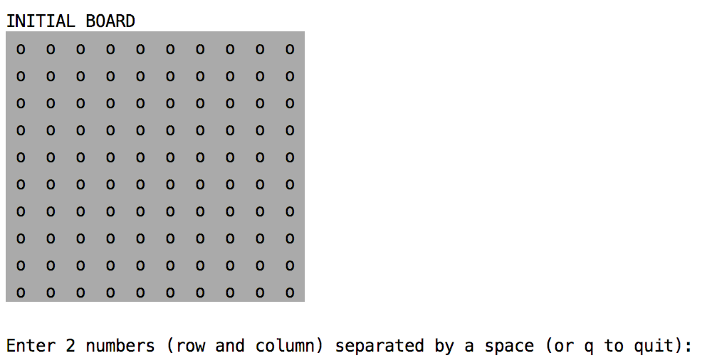
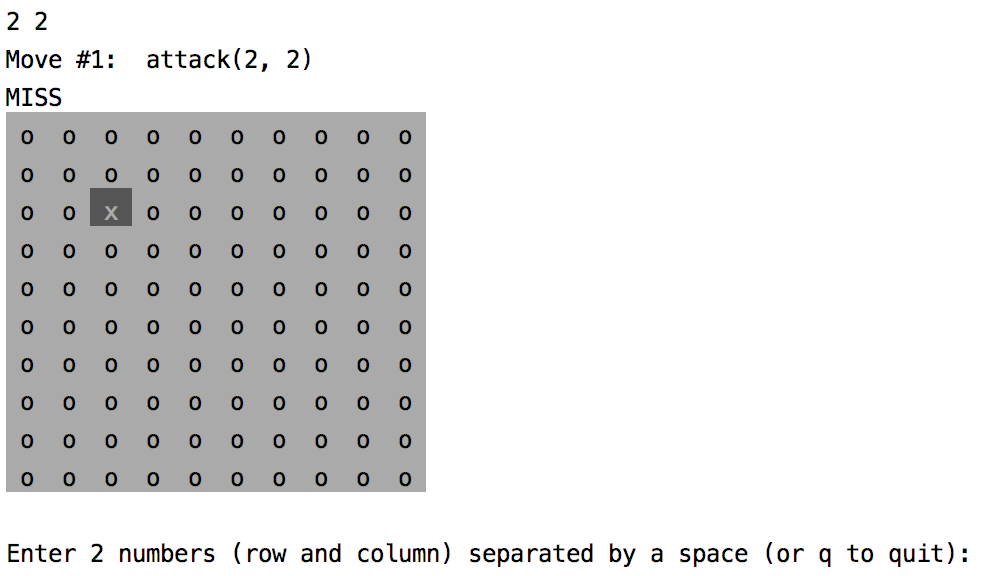
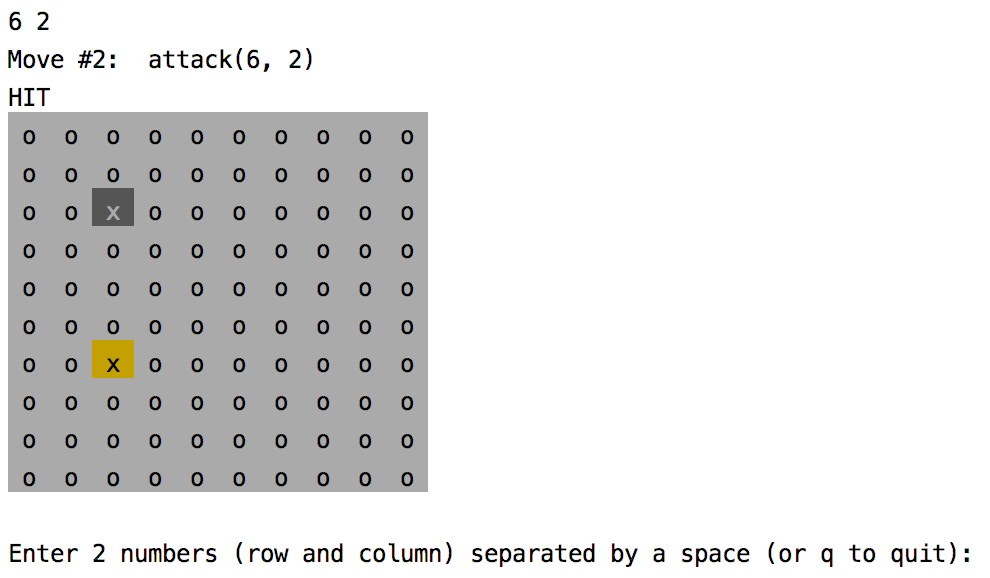
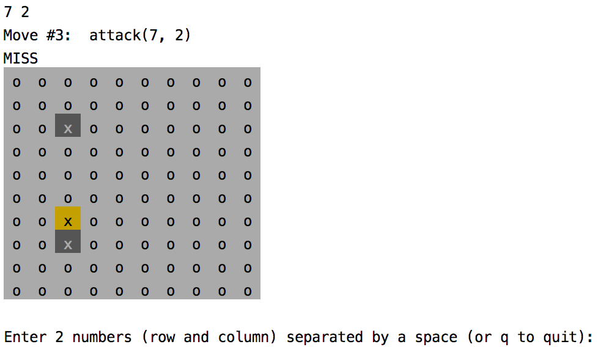
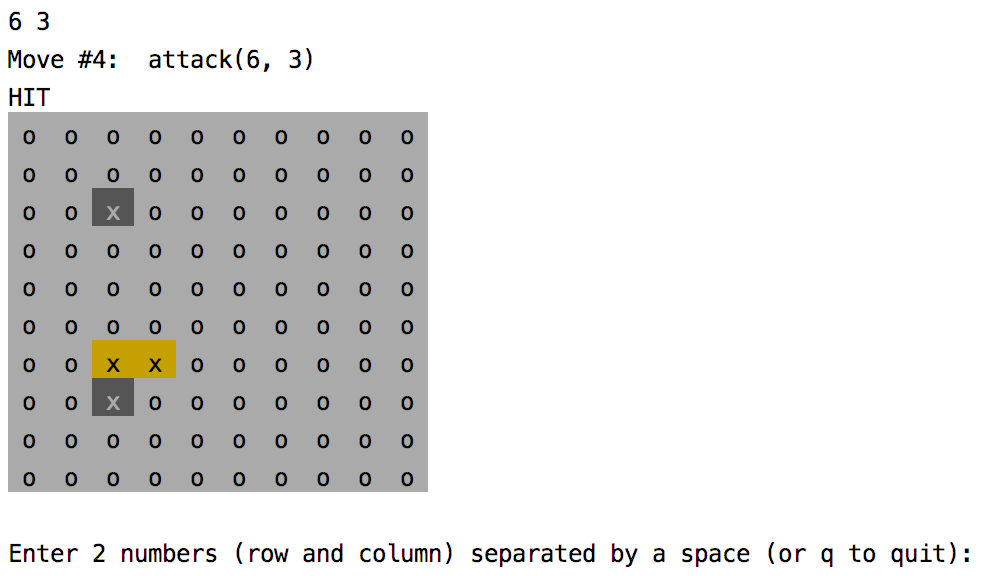
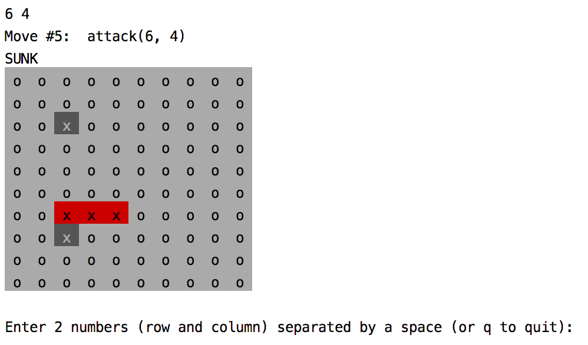
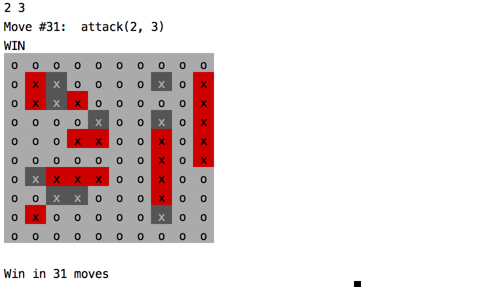

# Battleship

This software package is written in Node JavaScript, and represents the 
back-end system for playing the game Battleship.

According to [Wikipedia](https://en.wikipedia.org/wiki/Battleship_%28game%29):

> Battleship is a strategy type guessing game 
>for two players. It is played on ruled grids (paper or board) on which 
>each player's fleet of ships (including battleships) are marked. The 
>locations of the fleets are concealed from the other player. Players 
>alternate turns calling "shots" at the other player's ships, and the 
>objective of the game is to destroy the opposing player's fleet.

**Paper version of Battleship**


## Installation

Node version 8 or greater must be installed, as well as npm (Node Package
Manager). In a terminal window, install the required Node packages:

```bash
git clone https://github.com/stefanzero/battleship.git
npm install
```

## ESDOCS

The [Esdoc](https://esdoc.org/) system is used to generate web pages 
describing the software components.  By adding special text comments 
called "annotations" within the code, the esdoc Node module reads 
the source files and generates the output files.  The configuration for
Esdoc is in the esdoc section of the package.json file.  The documents 
have already been generated (in this zipfile of Battleship) and are 
located in the docs directory.

Here is an screen shot of the ESDOCS:



<br />
The documents can be generated again with a command in the scripts 
section of package.json.  The "Dev dependencies" (esdoc and related
esdoc plugins) in the package.json must be installed prior to generating 
the docs.

```bash
npm install --dev
npm run docs
```

## Demo Docs Server

Static HTML content (files) can be opened with a web browser, but dynamic 
content requires a web server to generate the content.  In the Esdocs, a "Demo"
web page has been created, that "auto-plays" a random arrangement of 
ships.  Each time the demo page is reloaded, a new game is played and 
displayed. This new game is created by a Node program in the scripts 
directory (scripts/create-demo.js).

<br />
A Node program (scripts/serve-docs.js) has been included in this package that runs 
a local HTTP server (on port 8081) that will serve these ESDOCS.  A command 
in the scripts section of package.json ("serve") will start this local server and 
automatically open the default browser to the Home page of the documentation.
**Please run the install command first, then the serve command NOW**
so you can see the documentation for the sections to be described
below.

```bash
npm install
npm run serve
```

This ReadMe page is duplicated by Esdocs and displayed on the **Home**
link in the navigation bar.

If for some reason Node cannot open a local HTTP server on port 8081, please
open the docs home page directly in your browser:

```bash
open docs/index.html
```
In this case, the Demo page is static and reloading it will just display 
the same game simulation.

## Object-oriented Design

All the objects are displayed in the left column of the Esdocs web
page.  Please click on each item to display a detailed web page with 
a description of all its members and methods.

* Board
* Tile
* Ship
* Moves
* Game
* Utils
* parameters

<br />
The Board is the main object that contains tiles and ships, 
and the methods to add ships, automatically set up the board, 
and conduct attacks.  The Board also has a Moves object, which 
keeps track of the history of the game, including a string and 
HTML representation of the board after each move (attack).

<br />
The parameters object contains all the constants for configuring 
the game:
* numRows
* numColumns
* shipTypes
* orientations (this should not be changed)

<br />
The shipTypes is an object containing the essential information for
a given ship type:
* shipTypeId (number 1 - 5)
* name (Aircraft Carrier, Battleship, Cruiser, Destroyer, Submarine)
* length (5, 4, 3, 2, 1 for ships above)
* number of each type on the board (1, 1, 1, 2, 2 for ships above)
* color (for Board.toString)
* backgroundColor (for Board.toHtml)

<br />
The Game class implements a strategy for playing the game, and
is used to create the Demo page of the Esdocs.  The Game constructor
creates a new board and then sets up the board with ships at 
random positions.  The Game has a **play** method that conducts 
random attacks until a hit is achieved.  Then the surrounding 
tiles of the hit are stored on a stack to be  attacked.  

<br />
When a second hit is achieved, the stack is filtered to positions that 
are in a line with the last hit.  When an attack results in a sunken 
ship, the stack is emptied.  But if the stack is emptied without a
sunken ship, the last stack is restored. This is done because if 
two ships are adjacent, the filtering strategy would remove positions 
that should still be tried.  This relatively simple strategy greatly 
improves the rate at which all ships are sunk.  

<br />
The auto-play game strategy usually results in a ship being sunk if a 
few moves after any one of its positions are hit.  Since a submarine
has a length of 1 (only 1 tile), it is the hardest ship to sink.
Most often, the submarine is the last ship to be sunk in the auto-play 
simulation.

## Unit and Functional Tests

The Mocha testing utility and the Chai assertion library are used 
to write unit tests for every class and class method.  The tests 
are displayed in the **Test** link in the navigation bar.  

The **Demo** link in the navigation bar is an end-to-end functional 
test of Battleship.  Each time the **Demo** page is reloaded (while the
"npm run server" command is executing), a new 
instance of the Game class is created, which creates a new instance of
Board which is set up with all required ships at random (valid) 
positions.  Then the play method of Game is called.  

The results of the Demo game are displayed as table with 3 columns:
* Description: Move Number, Position Attacked, Attack Result
* Game View: Display of the game with the ships (Enemy View)
* Player View: Display of the game with positions attacked, hit or sunk

<br />
Scrolling down the demo page shows the effectiveness of the auto-play 
strategy.  After a random attack results in a hit, the positions surrounding 
that hit are called and the ship is usually sunk in a few moves later.

## Changing Game Parameters

The game parameters are in the file parameters.js.  The values for numRows 
and numColumns can be edited to change the size of the board.  The values 
in shipTypes can be edited to change the type of ships on the board, their 
length, number of each type, and color displayed.

## Playing the game

A Node program is included in the package to allow a single player to attack a
board with a random arrangment of ships.  In a terminal window this command
starts the game:

```bash
npm run play
```

This starts the program scripts/play.js, which displays the board after each
attack and a prompt to enter the next attack.



Let's attack 2, 2.
It is a Miss, so the tile is shown with an "x" in a dark gray:



Let's attack 6, 2.
It is a Hit, so the tile is shown with an "x" in orange:



Here are a few  more attacks:






Now we get a Hit on the last position of a ship, so it is 
sunk and marked with all x's in red.



After many moves, we finally sink the last ship:



## Future extensions

Future extensions to this package could be a hosted Express (Node) web site with
API routes to start a new game, add ships, and accept moves (attacks) upon the 
enemy.  This could be accompanied by a front-end web site to allow players to 
use these APIs and display both the "Home View"  (Game view for the player), and
"Player View" for tracking the attacks upon the enemies.  These would correspond 
to the "Game View" and "Player View" columns of the **Demo** page.


