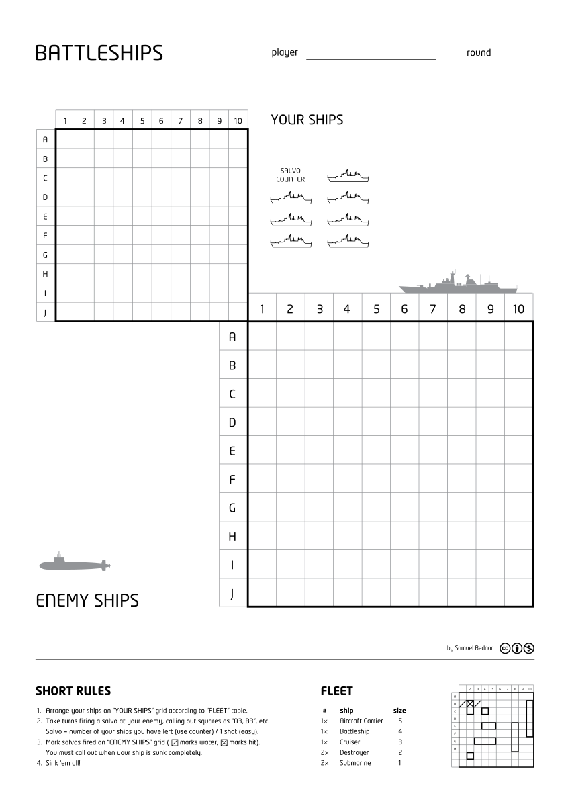

# Battleship

This software package is written in Node JavaScript, and represents the 
back-end system for playing the game Battleship.

According to [Wikipedia](https://en.wikipedia.org/wiki/Battleship_%28game%29):

> Battleship is a strategy type guessing game 
>for two players. It is played on ruled grids (paper or board) on which 
>each player's fleet of ships (including battleships) are marked. The 
>locations of the fleets are concealed from the other player. Players 
>alternate turns calling "shots" at the other player's ships, and the 
>objective of the game is to destroy the opposing player's fleet.

#### Image of paper version of Battleship




## Installation

Node version 8 or greater must be installed, as well as npm (Node Package
Manager). In a terminal window, install the required Node packages:

```bash
npm install
```

## ESDOCS

The [Esdoc](https://esdoc.org/) system is used to generate web pages 
describing the software components.  By adding special text comments 
called "annotations" within the code, the esdoc Node module reads 
the source files and generates the output files.  The configuration for
Esdoc is in the esdoc section of the package.json file.  The documents 
have already been generated (in this zipfile of Battleship) and are 
located in the docs directory.

The documents can be generated again with a command in the scripts 
section of package.json.  The "Dev dependencies" (esdoc and related
esdoc plugins) in the package.json must be installed prior to generating 
the docs.

```bash
npm install --dev
npm run docs
```

## Demo Docs Server

Static HTML content (files) can be opened with a web browser, but dynamic 
content requires a web server to generate the content.  In the Esdocs, a "Demo"
web page has been created, that "auto-plays" a random arrangement of 
ships.  Each time the demo page is reloaded, a new game is played and displayed.

A Node program has been included in this package that runs a local HTTP 
server (on port 8081) that will run this Demo web page.  A command in the scripts 
section of package.json will start this local server and automatically 
open the default browser to the Home page of the documentation.
**Please run the install command first, then the serve command NOW**
so you can see the documentation for the sections to be described
below.

```bash
npm install
npm run serve
```

This ReadMe page is duplicated by Esdocs and displayed on the **Home**
link in the navigation bar.

## Object-oriented Design

All the objects are displayed in the left column of the Esdocs web
page:

* Board
* Tile
* Ship
* Moves
* Game
* Utils
* parameters

The Board is the main object that contains tiles and ships, 
and the methods to add ships, automatically set up the board, 
and conduct attacks.  The Board also has a Moves object, which 
keeps track of the history of the game, including a string and 
HTML representation of the board after each move (attack).

The Game class implements a strategy for playing the game, and
is used to create the Demo page of the Esdocs.  The Game constructor
creates a new board and then sets up the board with ships at 
random positions.  The Game has a play method that conducts 
random attacks until a hit is achieved.  Then the surrounding 
tiles of the hit are stored on a stack to be  attacked.  This 
relatively simple strategy greatly improves the rate at which 
all ships are sunk.

## Unit and Functional Tests


## Game Parameters

The game parameters are in the file parameters.js


## Playing the game


